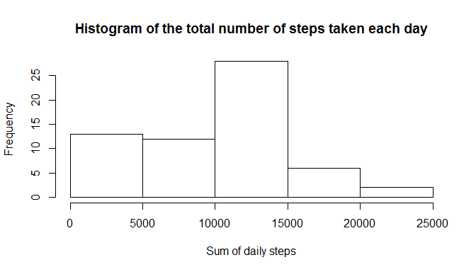
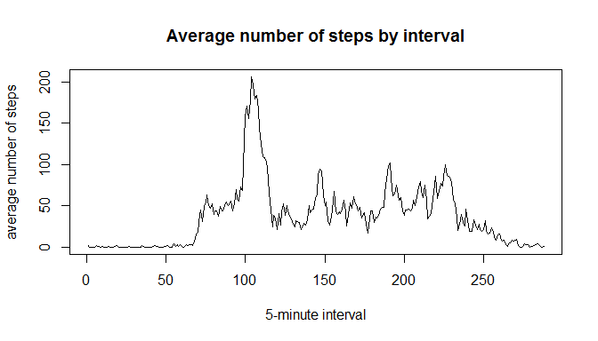
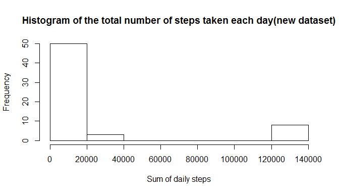
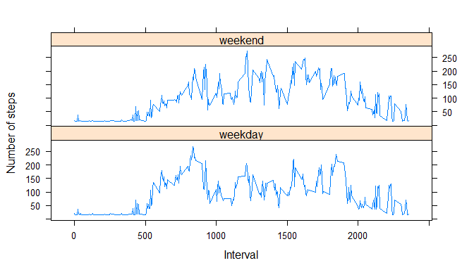

# Reproducible Research: Peer Assessment 1


## Loading and preprocessing the data
1. Load the data using read.csv(), save the data to act


```r
act <- read.csv("activity.csv", stringsAsFactors = FALSE)
```
2. Process the data, sum steps by day


```r
sum_by_day <- tapply(act$steps, act$date, sum, na.rm = TRUE)
```

## What is mean total number of steps taken per day?
1. Make a histogram of the total number of steps taken each day


```r
hist(sum_by_day,
     main = "Histogram of the total number of steps taken each day",
     xlab = "Sum of daily steps")
```

 

2. Calculate and report the mean and median total number of steps taken per day


```r
mean_by_day <- tapply(act$steps, act$date, mean, na.rm = TRUE)
median_by_day <- tapply(act$steps, act$date, median, na.rm = TRUE)
rep <- cbind.data.frame(names(mean_by_day),
                        as.numeric(mean_by_day),
                        as.numeric(median_by_day))
names(rep) <- c("date","mean","median")
rep
```

```
##          date       mean median
## 1  2012-10-01        NaN     NA
## 2  2012-10-02  0.4375000      0
## 3  2012-10-03 39.4166667      0
## 4  2012-10-04 42.0694444      0
## 5  2012-10-05 46.1597222      0
## 6  2012-10-06 53.5416667      0
## 7  2012-10-07 38.2465278      0
## 8  2012-10-08        NaN     NA
## 9  2012-10-09 44.4826389      0
## 10 2012-10-10 34.3750000      0
## 11 2012-10-11 35.7777778      0
## 12 2012-10-12 60.3541667      0
## 13 2012-10-13 43.1458333      0
## 14 2012-10-14 52.4236111      0
## 15 2012-10-15 35.2048611      0
## 16 2012-10-16 52.3750000      0
## 17 2012-10-17 46.7083333      0
## 18 2012-10-18 34.9166667      0
## 19 2012-10-19 41.0729167      0
## 20 2012-10-20 36.0937500      0
## 21 2012-10-21 30.6284722      0
## 22 2012-10-22 46.7361111      0
## 23 2012-10-23 30.9652778      0
## 24 2012-10-24 29.0104167      0
## 25 2012-10-25  8.6527778      0
## 26 2012-10-26 23.5347222      0
## 27 2012-10-27 35.1354167      0
## 28 2012-10-28 39.7847222      0
## 29 2012-10-29 17.4236111      0
## 30 2012-10-30 34.0937500      0
## 31 2012-10-31 53.5208333      0
## 32 2012-11-01        NaN     NA
## 33 2012-11-02 36.8055556      0
## 34 2012-11-03 36.7048611      0
## 35 2012-11-04        NaN     NA
## 36 2012-11-05 36.2465278      0
## 37 2012-11-06 28.9375000      0
## 38 2012-11-07 44.7326389      0
## 39 2012-11-08 11.1770833      0
## 40 2012-11-09        NaN     NA
## 41 2012-11-10        NaN     NA
## 42 2012-11-11 43.7777778      0
## 43 2012-11-12 37.3784722      0
## 44 2012-11-13 25.4722222      0
## 45 2012-11-14        NaN     NA
## 46 2012-11-15  0.1423611      0
## 47 2012-11-16 18.8923611      0
## 48 2012-11-17 49.7881944      0
## 49 2012-11-18 52.4652778      0
## 50 2012-11-19 30.6979167      0
## 51 2012-11-20 15.5277778      0
## 52 2012-11-21 44.3993056      0
## 53 2012-11-22 70.9270833      0
## 54 2012-11-23 73.5902778      0
## 55 2012-11-24 50.2708333      0
## 56 2012-11-25 41.0902778      0
## 57 2012-11-26 38.7569444      0
## 58 2012-11-27 47.3819444      0
## 59 2012-11-28 35.3576389      0
## 60 2012-11-29 24.4687500      0
## 61 2012-11-30        NaN     NA
```

## What is the average daily activity pattern?
1. Make a time series plot(i.e. type = "l") of the 5-minute interval (x-axis) 
and the average number of steps taken, averaged across all days (y-axis)


```r
mean_by_interval = tapply(act$steps, act$interval, mean, na.rm = TRUE)
plot(
    mean_by_interval,
    type = "l",
    main = "Average number of steps by interval",
    ylab = "average number of steps",
    xlab = "5-minute interval"
    )
```

 

2. Which 5-minute interval, on average across all the days in the dataset,
contains the maximum number of steps?


```r
which(mean_by_interval == max(mean_by_interval))
```

```
## 835 
## 104
```
It's the 8:35 interval containing the maximum number of steps.

## Imputing missing values
1. Calculate and report the total number of missing values in the dataset (i.e. the total number of rows with NAs)


```r
sum(is.na(act$steps))
```

```
## [1] 2304
```

2. Devise a strategy for filling in all of the missing values in the dataset.
Here, the strategy is inputting NA using the mean for that 5-minute interval.


```r
# define the funtion to input missing values
imputNA <- function(rowData) {
    if (is.na(rowData[1]))
        return(mean_by_interval[[paste0(as.numeric(rowData[3]))]])
    else
        return(rowData[1])
    }
```

3. Create a new dataset that is equal to the original dataset but with the missing data filled in.


```r
# new dataset, NA is replaced by interval mean
act2 = cbind(apply(act,1,imputNA), act[2:3])
# fix column names
names(act2) = c(names(act))
# convert steps to numeric
act2$steps = as.numeric(act2$steps)
```

4. Make a histogram of the total number of steps taken each day and Calculate
and report the mean and median total number of steps taken per day.


```r
sum_by_day_new <- tapply(act2$steps, act2$date, sum)
hist(sum_by_day_new,
     main = "Histogram of the total number of steps taken each day(new dataset)",
     xlab = "Sum of daily steps")
```

 

```r
mean_by_day_new = tapply(act2$steps, act2$date, mean)
median_by_day_new = tapply(act2$steps, act2$date, median)
rep2 = cbind.data.frame(
    names(mean_by_day_new),
    as.numeric(mean_by_day_new),
    as.numeric(median_by_day_new)
    )
names(rep2) <- c("date","mean","median")
rep2
```

```
##          date       mean median
## 1  2012-10-01 426.364583    416
## 2  2012-10-02   1.583333      1
## 3  2012-10-03  48.951389      1
## 4  2012-10-04  52.277778      1
## 5  2012-10-05  58.173611      1
## 6  2012-10-06  67.281250      1
## 7  2012-10-07  47.222222      1
## 8  2012-10-08 426.364583    416
## 9  2012-10-09  53.225694      1
## 10 2012-10-10  42.802083      1
## 11 2012-10-11  41.923611      1
## 12 2012-10-12  71.684028      1
## 13 2012-10-13  53.791667      1
## 14 2012-10-14  65.611111      1
## 15 2012-10-15  41.395833      1
## 16 2012-10-16  62.565972      1
## 17 2012-10-17  56.534722      1
## 18 2012-10-18  42.350694      1
## 19 2012-10-19  51.649306      1
## 20 2012-10-20  45.020833      1
## 21 2012-10-21  38.055556      1
## 22 2012-10-22  56.378472      1
## 23 2012-10-23  39.142361      1
## 24 2012-10-24  36.232639      1
## 25 2012-10-25  10.829861      1
## 26 2012-10-26  29.562500      1
## 27 2012-10-27  44.434028      1
## 28 2012-10-28  49.725694      1
## 29 2012-10-29  21.531250      1
## 30 2012-10-30  42.444444      1
## 31 2012-10-31  64.815972      1
## 32 2012-11-01 426.364583    416
## 33 2012-11-02  43.267361      1
## 34 2012-11-03  45.663194      1
## 35 2012-11-04 426.364583    416
## 36 2012-11-05  43.256944      1
## 37 2012-11-06  36.322917      1
## 38 2012-11-07  54.486111      1
## 39 2012-11-08  13.572917      1
## 40 2012-11-09 426.364583    416
## 41 2012-11-10 426.364583    416
## 42 2012-11-11  54.364583      1
## 43 2012-11-12  47.385417      1
## 44 2012-11-13  31.743056      1
## 45 2012-11-14 426.364583    416
## 46 2012-11-15   1.142361      1
## 47 2012-11-16  23.788194      1
## 48 2012-11-17  59.232639      1
## 49 2012-11-18  62.395833      1
## 50 2012-11-19  35.763889      1
## 51 2012-11-20  20.052083      1
## 52 2012-11-21  52.868056      1
## 53 2012-11-22  89.173611      1
## 54 2012-11-23  89.819444      1
## 55 2012-11-24  59.260417      1
## 56 2012-11-25  51.552083      1
## 57 2012-11-26  46.152778      1
## 58 2012-11-27  55.555556      1
## 59 2012-11-28  42.003472      1
## 60 2012-11-29  30.572917      1
## 61 2012-11-30 426.364583    416
```

## Are there differences in activity patterns between weekdays and weekends?
1. Create a new factor variable in the dataset with two levels -- "weekday" and
"weekend" indicating whether a given date is a weekday or weekend day


```r
# define a function to process weekday and weekend
weekdayorweekend <- function (x) {
    w = weekdays(as.Date.character(x), abbreviate = TRUE)
    if (w == "Sun" | w == "Sat")
        result = "weekend"
    else
        result = "weekday"
    return(result)
    }
# add new variable wday to act2
act2 = cbind(act2,
             as.vector(sapply(act$date,
             weekdayorweekend,
             simplify = TRUE)))
names(act2) <- c(names(act2)[1:3], "wday")
```

2. Make a panel plot containing a time series plot (i.e. type = "l") of the
5-minute interval (x-axis) and the average number of steps taken, averaged
across all weekday days or weekend days (y-axis).


```r
library(plyr)
library(lattice)
ddata = ddply(act2, c("interval","wday"), summarise, mean = mean(steps, na.rm =
                                                                     TRUE))
xyplot(
    mean ~ interval | wday, layout = c(1,2), data = ddata, type = "l",
    xlab = "Interval",
    ylab = "Number of steps"
    )
```

 
